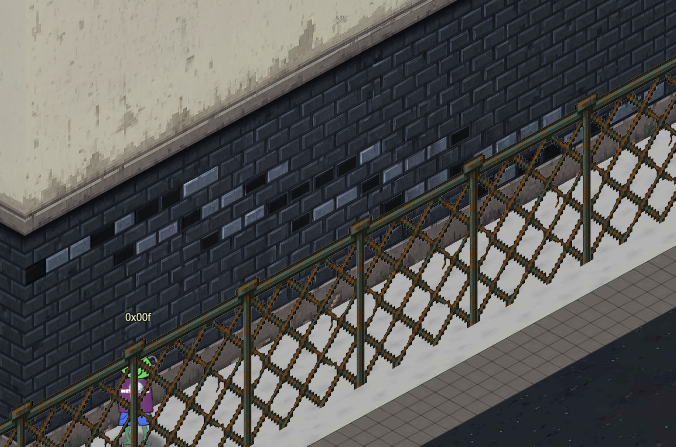

# Find and Shutdown Frosty's Snowglobe Machine

## Objective

Difficulty: ❄️ ❄️ ❄️  
[Hints](../hints/hint-frostys_snowglobe.md) and [Conversations](../hints/chat-elder-gnome.md)

You've heard murmurings around the city about a wise, elderly gnome having a change of heart. He must have information about where Frosty's Snowglobe Machine is. You should find and talk to the gnome so you can get some help with how to make your way through the Data Center's labrynthian halls.

Once you find the Snowglobe Machine, figure out how to shut it down and melt Frosty's cold, nefarious plans.

## Solution / Flag

TBD

Not sure if this is the message

