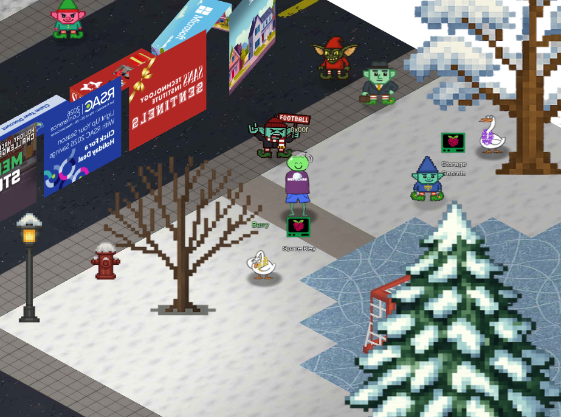

# Spare Key

## Challenge

Difficulty: ❄️  

Help Goose Barry near the pond identify which identity has been granted excessive Owner permissions at the subscription level, violating the principle of least privilege.

## Solution 

Solve in terminal

## Detailed Solution

```bash
Let's start by listing all resource groups
$ az group list -o table
This will show all resource groups in a readable table format.

neighbor@9c2339678c29:~$ az group list -o table
Name                 Location    ProvisioningState
-------------------  ----------  -------------------
rg-the-neighborhood  eastus      Succeeded
rg-hoa-maintenance   eastus      Succeeded
rg-hoa-clubhouse     eastus      Succeeded
rg-hoa-security      eastus      Succeeded
rg-hoa-landscaping   eastus      Succeeded
```

```bash
Now let's find storage accounts in the neighborhood resource group 📦
$ az storage account list --resource-group rg-the-neighborhood -o table
This shows what storage accounts exist and their types.

neighbor@9c2339678c29:~$ az storage account list --resource-group rg-the-neighborhood -o table
Name             Kind         Location    ResourceGroup        ProvisioningState
---------------  -----------  ----------  -------------------  -------------------
neighborhoodhoa  StorageV2    eastus      rg-the-neighborhood  Succeeded
hoamaintenance   StorageV2    eastus      rg-hoa-maintenance   Succeeded
hoaclubhouse     StorageV2    eastus      rg-hoa-clubhouse     Succeeded
hoasecurity      BlobStorage  eastus      rg-hoa-security      Succeeded
hoalandscaping   StorageV2    eastus      rg-hoa-landscaping   Succeeded
neighbor@9c2339678c29:~$ 
```

```bash
Someone mentioned there was a website in here.
maybe a static website?
try:$ az storage blob service-properties show --account-name <insert_account_name> --auth-mode login

neighbor@9c2339678c29:~$ az storage blob service-properties show --account-name neighborhoodhoa --auth-mode login
{
  "enabled": true,
  "errorDocument404Path": "404.html",
  "indexDocument": "index.html"
}
```

```bash
Let's see what 📦 containers exist in the storage account
💡 Hint: You will need to use az storage container list
We want to list the container and its public access levels.

neighbor@9c2339678c29:~$ az storage container list --account-name neighborhoodhoa --auth-mode login
[
  {
    "name": "$web",
    "properties": {
      "lastModified": "2025-09-20T10:30:00Z",
      "publicAccess": null
    }
  },
  {
    "name": "public",
    "properties": {
      "lastModified": "2025-09-15T14:20:00Z",
      "publicAccess": "Blob"
    }
  }
]
```

```bash
Examine what files are in the static website container
💡 hint: when using --container-name you might need '<name>'
Look 👀 for any files that shouldn't be publicly accessible!

neighbor@9c2339678c29:~$ az storage blob list --container-name '$web' --account-name neighborhoodhoa --auth-mode login --output table
Name                  ContentLength    ContentType
--------------------  ---------------  -------------
index.html            512              text/html
about.html            384              text/html
iac/terraform.tfvars  1024             text/plain
```

```bash
Take a look at the files here, what stands out?
Try examining a suspect file 🕵️:
💡 hint: --file /dev/stdout | less will print to your terminal 💻.

az storage blob download  --container-name '$web' --account-name neighborhoodhoa --auth-mode login --name "iac/terraform.tfvars" --file /dev/stdout  | less

# Terraform Variables for HOA Website Deployment
# Application: Neighborhood HOA Service Request Portal  
# Environment: Production
# Last Updated: 2025-09-20
# DO NOT COMMIT TO PUBLIC REPOS

# === Application Configuration ===
app_name = "hoa-service-portal"
app_version = "2.1.4"
environment = "production"

# === Database Configuration ===
database_server = "sql-neighborhoodhoa.database.windows.net"
database_name = "hoa_requests"
database_username = "hoa_app_user"
# Using Key Vault reference for security
database_password_vault_ref = "@Microsoft.KeyVault(SecretUri=https://kv-neighborhoodhoa-prod.vault.azure.net/secrets/db-password/)"

# === Storage Configuration for File Uploads ===
storage_account = "neighborhoodhoa"
uploads_container = "resident-uploads"
documents_container = "hoa-documents"

# TEMPORARY: Direct storage access for migration script
# WARNING: Remove after data migration to new storage account
# This SAS token provides full access - HIGHLY SENSITIVE!
migration_sas_token = "sv=2023-11-03&ss=b&srt=co&sp=rlacwdx&se=2100-01-01T00:00:00Z&spr=https&sig=1djO1Q%2Bv0wIh7mYi3n%2F7r1d%2F9u9H%2F5%2BQxw8o2i9QMQc%3D"

# === Email Service Configuration ===
# Using Key Vault for sensitive email credentials
sendgrid_api_key_vault_ref = "@Microsoft.KeyVault(SecretUri=https://kv-neighborhoodhoa-prod.vault.azure.net/secrets/sendgrid-key/)"
from_email = "noreply@theneighborhood.com" 
admin_email = "admin@theneighborhood.com"

# === Application Settings ===
session_timeout_minutes = 60
max_file_upload_mb = 10
allowed_file_types = ["pdf", "jpg", "jpeg", "png", "doc", "docx"]

# === Feature Flags ===
enable_online_payments = true
enable_maintenance_requests = true
enable_document_portal = false
enable_resident_directory = true

# === API Keys (Key Vault References) ===
maps_api_key_vault_ref = "@Microsoft.KeyVault(SecretUri=https://kv-neighborhoodhoa-prod.vault.azure.net/secrets/maps-api-key/)"
weather_api_key_vault_ref = "@Microsoft.KeyVault(SecretUri=https://kv-neighborhoodhoa-prod.vault.azure.net/secrets/weather-api-key/)"

# === Notification Settings (Key Vault References) ===
sms_service_vault_ref = "@Microsoft.KeyVault(SecretUri=https://kv-neighborhoodhoa-prod.vault.azure.net/secrets/sms-credentials/)"
notification_webhook_vault_ref = "@Microsoft.KeyVault(SecretUri=https://kv-neighborhoodhoa-prod.vault.azure.net/secrets/slack-webhook/)"

# === Deployment Configuration ===
deploy_static_files_to_cdn = true
cdn_profile = "hoa-cdn-prod"
cache_duration_hours = 24

# Backup schedule
backup_frequency = "daily"
backup_retention_days = 30
{
  "downloaded": true,
  "file": "/dev/stdout"
}
```

```bash
You found the leak! A migration_sas_token within /iac/terraform.tfvars exposed a long-lived SAS token (expires 2100-01-01) 🔑
⚠️   Accidentally uploading config files to $web can leak secrets. 🔐

Challenge Complete! To finish, type: finish

neighbor@9c2339678c29:~$ finish
```

```bash
🎉 Challenge complete! 🎉
```

## Game Location


